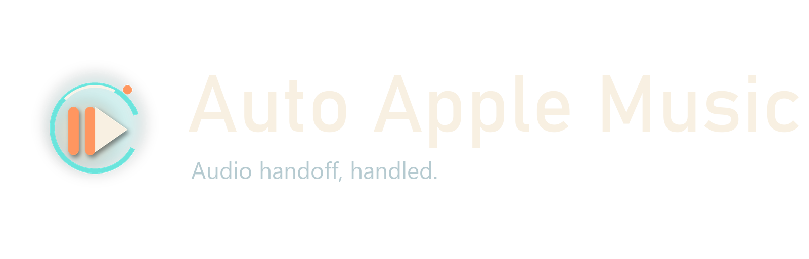

# Auto Apple Music



`Auto Apple Music` is a small Windows desktop app that keeps Apple Music as your fallback audio.

When the app is turned on:

- Apple Music pauses when other audio starts playing.
- Apple Music resumes when that outside audio stops.
- If you paused Apple Music yourself, the app waits for a fresh outside-audio cycle before it resumes anything.
- If Apple Music is closed, the app can open it and try to continue your last session.

This project was built mainly around the YouTube-on-your-browser workflow, but it works by watching Windows audio sessions, so it can respond to other non-Apple audio too.

## Requirements

- Windows 10 or Windows 11
- [Apple Music for Windows](https://apps.microsoft.com/) installed
- .NET 9 SDK installed

## Install

1. Clone the repo:

```powershell
git clone https://github.com/kienton1/Apple-Music-for-you-Low-Attention-Span.git
cd .\Apple-Music-for-you-Low-Attention-Span\
```

2. Build the solution:

```powershell
dotnet build .\AutoAppleMusic.sln
```

3. Run the desktop app:

```powershell
dotnet run --project .\AutoAppleMusic.App\AutoAppleMusic.App.csproj
```

## Usage

1. Open Apple Music on your PC and start playing something.
2. Launch `Auto Apple Music`.
3. Click the main button to turn automation on.
4. Start playing audio somewhere else, like YouTube in Chrome or Edge.
5. Apple Music should pause while that other audio is active.
6. When the outside audio stops, Apple Music should come back.

## Publish A Desktop Build

If you want a standalone published build instead of running through `dotnet run`, use:

```powershell
dotnet publish .\AutoAppleMusic.App\AutoAppleMusic.App.csproj -c Release -o .\dist\AutoAppleMusic
```

That will place the desktop executable here:

```text
.\dist\AutoAppleMusic\AutoAppleMusic.App.exe
```

You can then create a desktop shortcut to that `.exe`.

## Project Structure

- `AutoAppleMusic.App` - WPF desktop app, Windows media control, and audio-session monitoring
- `AutoAppleMusic.Core` - deterministic automation state machine
- `AutoAppleMusic.Tests` - regression and scenario tests
- `tools` - helper scripts, including branded asset generation

## Development

Run the test project with:

```powershell
dotnet test .\AutoAppleMusic.Tests\AutoAppleMusic.Tests.csproj
```

## Notes

- The app currently relies on Windows audio sessions, so browser audio like YouTube is detected through the browser's active audio session.
- Apple Music control depends on the Windows Apple Music app exposing media session controls correctly.
- The current UI, icon, and brand assets live under `AutoAppleMusic.App\Assets`.
